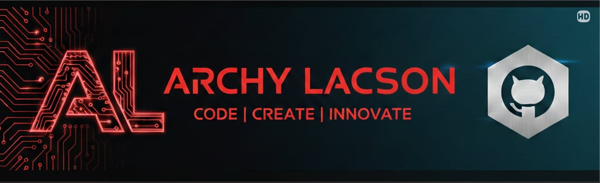

<!-- Banner -->

  

<!-- Profile Picture -->

  

# Hi there! Wassup 👋
I'm a *Aspiring Web Developer* passionate about building clean and responsive apps.

---

## 👨‍💻 About Me
- I'm a 3rd-year student pursuing a Bachelor of Science in Information Technology.
- I'm passionate about building *Full-Stack Applications* with modern technologies.
- I'm looking forward to collaborating on future projects.

---

## 🛠️ Tech Stack

  
  
  
  
  
  
  

---

## 🌐 Socials

  
  
  
  

